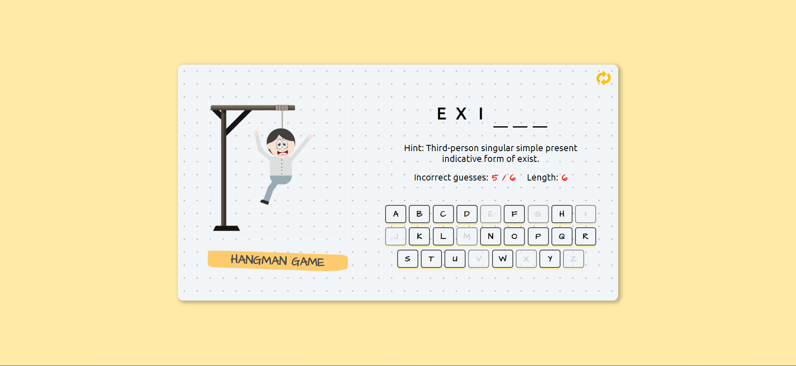

# Hangman Game

Welcome to the Hangman Game project! This is a classic word-guessing game built using React and Gemini AI.

## Demo

## Built With

- `Frontend:` React.js for building the user interface, state management, and dynamic rendering.
- `APIs:` Integration with external(Gemini AI) APIs to fetch random words and their definitions.
- `Styling:` CSS for designing the visual components and enhancing the user interface.
- `Deployment:` Netlify for hosting and rendering the game.

## Features

- Random word generation
- Interactive keyboard for letter guessing
- Real-time feedback on correct and incorrect guesses
- Hint for each word to aid players

## Getting Started

### Prerequisites

- Node.js and npm installed
- Web browser

### Installation

1. Clone the repository: `https://github.com/matin676/Hangman-Game.git`
2. Navigate to the directory: `cd Hangman-Game`
3. Install dependencies: `npm install`
4. Start the application: `npm start`
5. Open your browser and visit: `http://localhost:3000`

### Usage

- Open the game in your web browser.
- Click on letters to make guesses.
- The game will provide feedback on correct and incorrect guesses.
- Use the hint if needed.

## Game Rules

- The game selects a random word from its dictionary.
- Players must guess letters to reveal the word.
- Incorrect guesses lead to drawing a part of the hangman figure.
- The game ends when the player wins or the hangman is complete.

## Deployment

You can experience the game here: [Hangman Game](https://hangman77.netlify.app/).

## Contributors

- Matin Imam (GitHub: [Matin676](https://github.com/matin676))

## License

This project is licensed under the [MIT License](LICENSE).

## Contact

Feel free to reach out to me via LinkedIn: [Matin Imam](https://www.linkedin.com/in/matinimam/)

You can also contact me via email at matinimam77@gmail.com.

## Acknowledgements

- [React](https://reactjs.org/)
- [Netlify](https://www.netlify.com/)
- [Gemini AI](https://ai.google.dev/gemini-api/docs/get-started/tutorial?lang=web)

---
